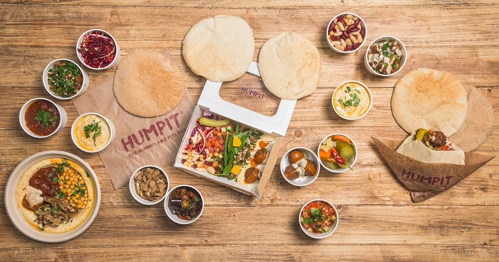
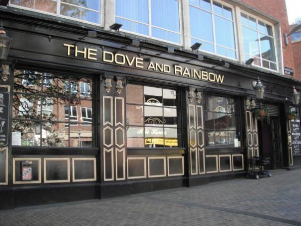
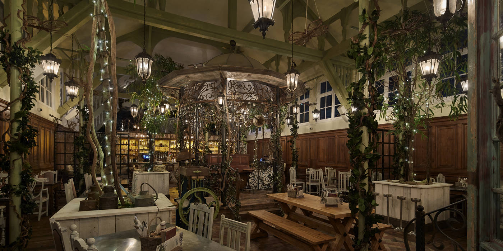

+++
title = "Food"
description = "Options for food on the day"
+++

    

## Lunch 🥪

As you all know, there are currently budgetary restrictions on all awaydays and events. We were determined to find a way to put on the GSS awayday again this year after such a successful day in 2024, but this means we have some restrictions on what we can do.

The government is currently not allowing any spend on catering for events like this, and so our hands are unfortunately tied. We didn’t think this should affect the day we have planned as the agenda is going absolutely jam packed full of valuable and fun sessions!

### What does this mean for you?

- If you are not Sheffield based, you will be able to claim T&S in line with the [department's expenses policy](https://educationgovuk.sharepoint.com/sites/travel-and-expenses/SitePages/claim.aspx#how-much-you-can-claim-for-subsistence). 
- On any claims for lunch on the day, please **change your cost centre to 10397 and email all receipts to analytical.lnd@education.gov.uk** as well as attaching in workday. 
- If you are staying overnight, please claim your other meals normally.
- Unfortunately, if you are Sheffield based, the venue is not over 10 miles from your workplace (the minimum distance for claims [as outlined in the guidance](https://educationgovuk.sharepoint.com/:w:/r/sites/travel-and-expenses/_layouts/15/Doc.aspx?sourcedoc=%7B7F87AB14-DE7E-4F79-B669-199BA8672DEA%7D&file=travel-and-expenses-policy.docx&wdLOR=c508B9ED3-E364-4412-BC99-1E98E39D9A83&action=default&mobileredirect=true)) and so Sheffield-ers will not be able to claim for lunch.
- I’ve raised this with the department's financial teams and had it reiterated that this is the guidance we must follow. Please make plans accordingly.

There are a number of nearby options for purchasing lunch, including the cafe inside the venue:

- [Eat at The Wave](https://sheffield.ac.uk/cafesandbars/wave-kitchen)
- [Food on Campus](https://sheffield.ac.uk/cafesandbars/cafes)

### Check out the nearby shop options

<iframe src="https://www.google.com/maps/embed?pb=!1m16!1m12!1m3!1d2850.916742032857!2d-1.497062222814997!3d53.3809153722993!2m3!1f0!2f0!3f0!3m2!1i1024!2i768!4f13.1!2m1!1sshop!5e1!3m2!1sen!2suk!4v1754393097772!5m2!1sen!2suk" width="100%" style="border:0;" allowfullscreen="" loading="lazy" referrerpolicy="no-referrer-when-downgrade"></iframe>

### Check out the nearby cafes

<iframe src="https://www.google.com/maps/embed?pb=!1m16!1m12!1m3!1d2850.946306765541!2d-1.4960966275696352!3d53.3804737929466!2m3!1f0!2f0!3f0!3m2!1i1024!2i768!4f13.1!2m1!1zY2Fmw6g!5e1!3m2!1sen!2suk!4v1754393222174!5m2!1sen!2suk" width="100%" style="border:0;" allowfullscreen="" loading="lazy" referrerpolicy="no-referrer-when-downgrade"></iframe>

## Places to Eat

### The Wave Shop

[More Information](https://sheffield.ac.uk/cafesandbars/wave-kitchen)  
[Back to Map](./../Sheffield.html#Map)

### Cambridge Street Collective

[More Information](https://www.welcometosheffield.co.uk/content/food-drink-and-nightlife/cambridge-street-collective/)  
[Back to Map](./../Sheffield.html#Map)

### Sheffield Plate

[More Information](https://www.welcometosheffield.co.uk/content/food-drink-and-nightlife/sheffield-plate/)  
[Back to Map](./../Sheffield.html#Map)

### The Steel Cauldron

[More Information](https://www.welcometosheffield.co.uk/content/food-drink-and-nightlife/the-steel-cauldron/)  
[Back to Map](./../Sheffield.html#Map)

### Thyme Cafe

[More Information](https://www.welcometosheffield.co.uk/content/food-drink-and-nightlife/thyme-cafe/)  
[Back to Map](./../Sheffield.html#Map)

### Ning's Thai Street Food

[More Information](https://www.welcometosheffield.co.uk/content/food-drink-and-nightlife/nings-thai-street-food/)  
[Back to Map](./../Sheffield.html#Map)

### The Street Food Chef

[More Information](https://www.welcometosheffield.co.uk/content/food-drink-and-nightlife/the-street-food-chef-the-canteen/)  
[Back to Map](./../Sheffield.html#Map)

### Church - Temple of Fun

[More Information](https://www.welcometosheffield.co.uk/content/food-drink-and-nightlife/church-temple-of-fun/)  
[Back to Map](./../Sheffield.html#Map)

### Sushi / Fro-yo / Breakfast

[More Information](https://www.google.co.uk/maps/@53.3796804,-1.4759203,3a,81.8y,20.45h,92.41t/data=!3m7!1e1!3m5!1sNkLcoWaM2DYx0E4GR3R9OQ!2e0!6shttps:%2F%2Fstreetviewpixels-pa.googleapis.com%2Fv1%2Fthumbnail%3Fcb_client%3Dmaps_sv.tactile%26w%3D900%26h%3D600%26pitch%3D-2.4141196367685325%26panoid%3DNkLcoWaM2DYx0E4GR3R9OQ%26yaw%3D20.446936122056734!7i16384!8i8192?entry=ttu&g_ep=EgoyMDI1MDgxMS4wIKXMDSoASAFQAw%3D%3D)  
[Back to Map](./../Sheffield.html#Map)

### Terrace Goods

[More Information](https://www.welcometosheffield.co.uk/content/food-drink-and-nightlife/terrace-goods/)  
[Back to Map](./../Sheffield.html#Map)

### Humpit - The Hummus & Pita Bar

[More Information](https://deliveroo.co.uk/menu/Sheffield-city-centre/humpit-sheffield)  
[Back to Map](./../Sheffield.html#Map)

## Pubs and Bars

### Sheffield Tap

[More Information](https://www.welcometosheffield.co.uk/content/food-drink-and-nightlife/sheffield-tap/)  
[Back to Map](./../Sheffield.html#Map)

### The Nottingham

[More Information](https://www.welcometosheffield.co.uk/content/food-drink-and-nightlife/the-nottingham-house/)  
[Back to Map](./../Sheffield.html#Map)

### Dam House

[More Information](https://www.tripadvisor.co.uk/Restaurant_Review-g186364-d2001453-Reviews-Dam_House_Bar_and_Restaurant-Sheffield_South_Yorkshire_England.html)  
[Back to Map](./../Sheffield.html#Map)

### The Dove & Rainbow & The Banker's Draft

[More Information](https://sheffield.camra.org.uk/2019/08/dove-rainbow-8/)  
[Back to Map](./../Sheffield.html#Map)

### The Museum & All Bar One

[More Information](https://www.yorkshirepost.co.uk/lifestyle/food-and-drink/pub-of-the-week-the-museum-sheffield-1764282)  
[Back to Map](./../Sheffield.html#Map)

### Triple Point Brewery

[More Information](https://www.welcometosheffield.co.uk/content/food-drink-and-nightlife/triple-point-brewery-bar/)  
[Back to Map](./../Sheffield.html#Map)

### The Fat Cat

[More Information](https://www.welcometosheffield.co.uk/content/food-drink-and-nightlife/the-fat-cat/)  
[Back to Map](./../Sheffield.html#Map)

### University Arms

[More Information](https://www.welcometosheffield.co.uk/content/food-drink-and-nightlife/the-university-arms/)  
[Back to Map](./../Sheffield.html#Map)

### The Red Deer

[More Information](https://www.welcometosheffield.co.uk/content/food-drink-and-nightlife/the-red-deer/)  
[Back to Map](./../Sheffield.html#Map)

### Bar One

[More Information](https://su.sheffield.ac.uk/eat-drink-shop/bar-one)  
[Back to Map](./../Sheffield.html#Map)

### Dog & Partridge

[More Information](https://www.welcometosheffield.co.uk/content/accommodation/the-dog-and-partridge-inn/)  
[Back to Map](./../Sheffield.html#Map)

### Frog & Parrot

[More Information](https://www.welcometosheffield.co.uk/content/food-drink-and-nightlife/the-frog-parrot/)  
[Back to Map](./../Sheffield.html#Map)

### The Benjamin Huntsman

[More Information](https://www.jdwetherspoon.com/pubs/the-benjamin-huntsman-sheffield)  
[Back to Map](./../Sheffield.html#Map)

### The Botanist

[More Information](https://thebotanist.uk.com/locations/sheffield/menus)  
[Back to Map](./../Sheffield.html#Map)

### The Globe

[More Information](https://www.yelp.com/biz/the-globe-sheffield)  
[Back to Map](./../Sheffield.html#Map)

### Head of Steam

[More Information](https://www.welcometosheffield.co.uk/content/food-drink-and-nightlife/the-head-of-steam/)  
[Back to Map](./../Sheffield.html#Map)