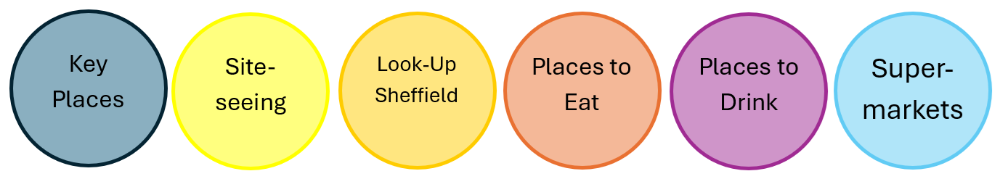
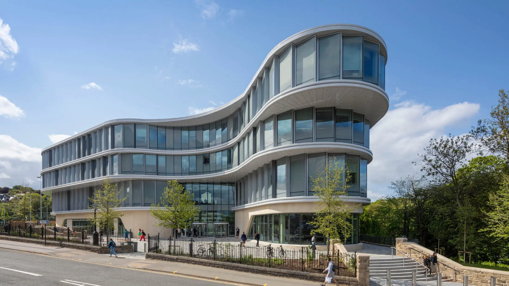

+++
title = "Sheffield"
+++

    

## Map

<map name="place_map">
    <area shape="circle" coords="244,330,24" alt="Weston Park" href="#Weston-Park">
    <area shape="circle" coords="209,339,5" alt="Look Up Weston Park" href="#Look-Up">
    <area shape="circle" coords="166,289,6" alt="Dam House" href="/Food#Dam-House">
    <area shape="circle" coords="119,364,24" alt="The Wave" href="#The-Wave">
    <area shape="circle" coords="121,366,6" alt="The Wave Shop" href="/Food#The-Wave-Shop">
    <area shape="circle" coords="40,468,6" alt="The Nottingham" href="/Food#The-Nottingham">
    <area shape="circle" coords="1,500,6" alt="The Steel Cauldron & Costa" href="/Food#The-Steel-Cauldron">
    <area shape="circle" coords="8,540,6" alt="Thyme Cafe" href="/Food#Thyme-Cafe">
    <area shape="circle" coords="65,724,24" alt="Botanical Gardens" href="#Botanical-Gardens">
    <area shape="circle" coords="950,215,25" alt="Victoria Quays" href="#Victoria-Quays">
    <area shape="circle" coords="850,390,35" alt="Coach Station" href="#Coach-Station">
    <area shape="circle" coords="895,485,34" alt="Train Station" href="#Train-Station">
    <area shape="circle" coords="883,458,14" alt="Sheffield Tap" href="/Food#Sheffield-Tap">
    <area shape="circle" coords="788,278,6" alt="The Dove & Rainbow & The Banker's Draft" href="/Food#Dove-Rainbow-Banker">
    <area shape="circle" coords="780,280,6" alt="Ning's Thai Street Food" href="/Food#Thai-Street-Food">
    <area shape="circle" coords="735,277,15" alt="Sheffield Cathedral" href="#Sheffield-Cathedral">
    <area shape="circle" coords="720,330,6" alt="Terrace Goods" href="/Food#Terrace-Goods">
    <area shape="circle" coords="717,347,8" alt="Sheffield Plate" href="/Food#Sheffield-Plate">
    <area shape="circle" coords="705,332,6" alt="All Bar One & The Museum" href="/Food#The-Museum-All-Bar-One">
    <area shape="circle" coords="702,345,6" alt="Humpit - The Hummus & Pita Bar" href="/Food#Humpit-Hummus">
    <area shape="circle" coords="809,474,6" alt="The Globe" href="/Food#The-Globe">
    <area shape="circle" coords="815,440,5" alt="Look Up Owen Building" href="#Look-Up">
    <area shape="circle" coords="788,400,5" alt="Look Up Grave's Gallery" href="#Look-Up">
    <area shape="circle" coords="766,378,6" alt="Head of Steam" href="/Food#Head-of-Steam">
    <area shape="circle" coords="757,408,15" alt="The Winter Garden" href="#The-Winter-Garden">
    <area shape="circle" coords="731,410,5" alt="Peace Gardens" href="#Peace-Gardens">
    <area shape="circle" coords="741,545,6" alt="The Street Food Chef" href="/Food#Street-Food-Chef">
    <area shape="circle" coords="748,641,6" alt="Triple Point Brewery" href="/Food#Triple-Point-Brewery">
    <area shape="circle" coords="598,23,6" alt="Church - Temple of Fun" href="/Food#Church-Temple-of-Fun">
    <area shape="circle" coords="673,58,6" alt="The Fat Cat" href="/Food#The-Fat-Cat">
    <area shape="circle" coords="365,340,6" alt="University Arms" href="/Food#University-Arms">
    <area shape="circle" coords="330,387,6" alt="Bar One" href="/Food#Bar-One">
    <area shape="circle" coords="439,347,5" alt="Look Up The Diamond" href="#Look-Up">
    <area shape="circle" coords="500,370,6" alt="The Red Deer" href="/Food#The-Red-Deer">
    <area shape="circle" coords="616,321,6" alt="Dog & Partridge" href="/Food#Dog-and-Partridge">
    <area shape="circle" coords="582,412,6" alt="Various Restaurants - Sushi / Fro-yo / Breakfast" href="/Food#Sushi-Fro-yo-Breakfast">
    <area shape="circle" coords="571,415,6" alt="Frog & Parrot" href="/Food#Frog-and-Parrot">
    <area shape="circle" coords="663,420,6" alt="The Benjamin Huntsman" href="/Food#The-Benjamin-Huntsman">
    <area shape="circle" coords="661,442,8" alt="Cambridge Street Collective" href="/Food#Cambridge-Street-Collective">
    <area shape="circle" coords="643,470,6" alt="The Botanist" href="/Food#The-Botanist">
    <area shape="circle" coords="673,405,5" alt="Look Up Old Cole Brother's Store" href="#Look-Up">
</map>

 

<map name="key_map">
    <area shape="circle" coords="90,90,80" alt="Key Places" href="#Key-Places">
    <area shape="circle" coords="250,90,80" alt="Key Places" href="#Sites">
    <area shape="circle" coords="420,90,80" alt="Key Places" href="#Look-Up">
    <area shape="circle" coords="580,90,80" alt="Key Places" href="/food#Food">
    <area shape="circle" coords="750,90,80" alt="Key Places" href="/food#Pubs/Bars">
    <area shape="circle" coords="910,90,80" alt="Key Places" href="#Supermarkets">
</map>

**Note: most places with an alcohol licence also provide food.**

## Key Places

### Train Station

[More Information](https://www.nationalrail.co.uk/stations/sheffield/)  
[Back to Map](#map)

### Coach Station

[More Information](https://www.nationalexpress.com/en/help/coach-stations/sheffield)  
[Back to Map](#map)

### The Wave

[More Information](./../pages/The-Wave/The-Wave.html)  
[Back to Map](#map)

## Things to See

### Sheffield Cathedral

[More Information](https://www.welcometosheffield.co.uk/content/attractions/sheffield-cathedral-st-peter-st-paul/)  
[Back to Map](#map)

### Victoria Quays

[More Information](https://www.welcometosheffield.co.uk/content/attractions/victoria-quays/)  
[Back to Map](#map)

### The Winter Garden

[More Information](https://www.welcometosheffield.co.uk/content/articles/the-winter-garden-and-peace-gardens/)  
[Back to Map](#map)

### Peace Gardens

[More Information](https://www.welcometosheffield.co.uk/content/articles/the-winter-garden-and-peace-gardens/)  
[Back to Map](#map)

### Weston Park

[More Information](https://www.welcometosheffield.co.uk/content/attractions/weston-park/)  
[Back to Map](#map)

### Botanical Gardens

[More Information](https://www.welcometosheffield.co.uk/content/attractions/sheffield-botanical-gardens/)  
[Back to Map](#map)

## Sheffield's virtual art

[More Information](https://www.welcometosheffield.co.uk/visit/look-up-ar-art-trail/)  
[Back to Map](#map)

## Supermarkets

[Back to Map](#map)
